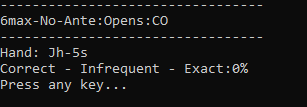

# Tool Overview

This tool has been created to facilitate the creation of custom Power Equilab ranges and provide an easy way to quiz yourself until the ranges become second nature.

## Configuration

To use this tool, follow these steps:

1. Download Power Equilab from http://power-equilab.com/.
2. Set up your custom ranges in Power Equilab.
   
3. Copy your `PreflopPredefined.ini` from your PowerEquilab folder to the root folder of this tool:
   - Example: `C:\Program Files (x86)\Power-Equilab\PreflopPredefined.ini` to `PokerRangeQuizzer\PreflopUserDefined.ini`.
   - A sample GTO 6max-no-ante range is included in the repository.

## Usage

To use this tool, follow these steps:

1. Navigate to the `src` folder and run the command `python main.py`.
2. There are three ways to select the range(s) to quiz:
   - 
   1. Enter a single number:
      - Example: `"71"` to test against the `6max-No-Ante:Vs_RFI:BB:v_HJ_3b` range.
   2. Enter a range of numbers:
      - Example: `"71-79"` to test against 9 ranges.
   3. Enter a comma-dilemeted list of numbers:
      - Example: `"71,72"` to test against the two ranges.
3. For this example, select "1" for `6max-No-Ante:Opens:BU`.
   - 
4. Enter "1", "2", or "3" indicating the frequency for `Jh-5s` given the range of `6max-No-Ante:Opens:BU`.
5. "1" was correctly selected.
   - 
6. Correct and incorrect answers are tracked:
   1. "1/1 @ 100% correct".
      - 
   2. Wrong hands are tracked to study the hands that were missed (example: `Kh-Qd`).
      - 
7. Entering "0" returns to the main menu at any time.
